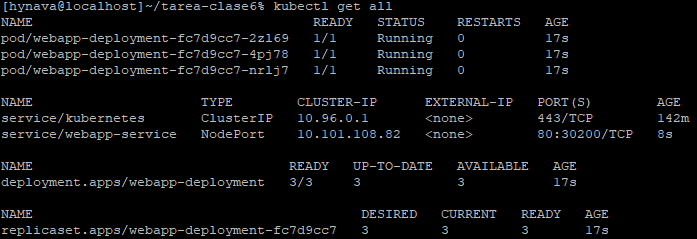
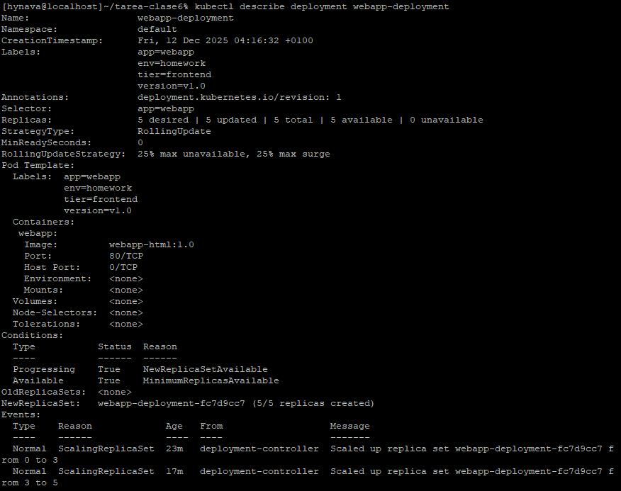
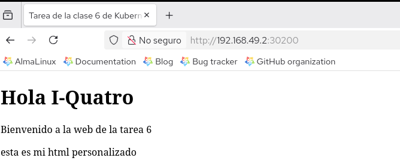
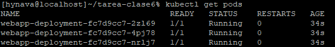
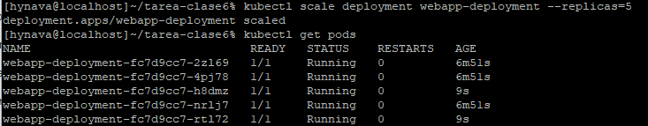
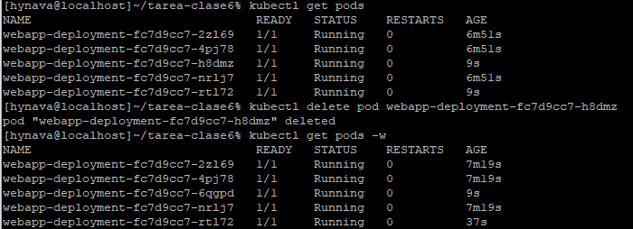

# Aplicación web para la Clase 6 de Docker Kubernetes

**Curso:** Docker & Kubernetes - Clase 6

**Estudiante:** Hans Nava

Corresponde al repositorio para la tarea de casa del curso Docker & Kubernetes para la clase 6.
Se despliega una aplicacion web básica en Kubernetes.

## Stack.

- **Aplicación:** Nginx
- **Kubernetes:** minikube
- **Réplicas:** 3

### Objetivo de la tarea
- Desplegar una aplicación web en Kubernetes.
- Usar un Deployment con 3 réplicas.
- Exponer la aplicación mediante un Service tipo NodePort en el puerto 30200.

### Archivos principales
- deployment.yaml -> define el Deployment con 3 réplicas de Nginx.
- service.yaml -> expone la aplicación vía NodePort.
- screenshots/ -> del despliegue, escalado y acceso web.

## Ejecución

Pasos para ejecutar
1. Clonar este repositorio:

```bash
git clone https://github.com/githanshync/tarea-clase6.git
cd tarea-clase6
```

2. Aplicar los manifiestos:

```bash
kubectl apply -f deployment.yaml
kubectl apply -f service.yaml
```
3. Verificar recursos:

```bash
kubectl get all
```
4. Acceder a la aplicación:

```bash
minikube service webapp-service --url
O abrir en navegador: http://<IP>:30200
```
5. Cómo probar.

- Ver recursos:
```bash
kubectl get all
```
- Acceder web:
```bash
http://<IP>:30200
```
- Escalado y Auto-healing
Escalar a 5 réplicas:

```bash
kubectl scale deployment webapp-deployment --replicas=5
kubectl get pods
```
## Capturas de pantalla

### Recursos desplegados


### kubectl describe deployment webapp-deployment


### Aplicación funcionando





### Escalado a 5 réplicas


### Eliminar un pod y observar cómo Kubernetes lo recrea:

```bash
kubectl delete pod <nombre-pod>
kubectl get pods -w
```


### Ver logs


## Conceptos Kubernetes

- Deployment con 3 réplicas
- Service tipo NodePort
- Labels y selectors
- Auto-healing
- Escalado horizontal
